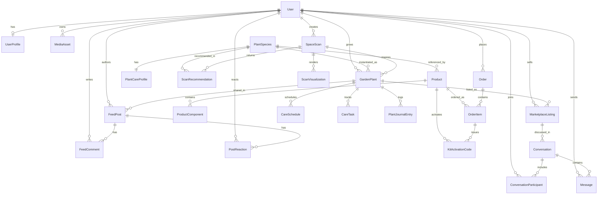

# CITYFARM 2.0 Database Schema

## Overview

CITYFARM 2.0 dùng một nguồn dữ liệu chính là PostgreSQL với Prisma để phục vụ ba lớp nghiệp vụ:

- Core gardening: scan không gian, gợi ý cây, theo dõi cây, nhật ký và lịch chăm sóc.
- Commerce: catalog sản phẩm, order kit, mã kích hoạt QR.
- Community: social feed, marketplace, chat buyer/seller và AI assistant.

Thiết kế này ưu tiên `Postgres + Prisma` cho phase đầu. Những payload AI có cấu trúc chưa ổn định được giữ trong các cột `Json` để tránh khóa cứng schema quá sớm.

## Design Principles

- `Postgres` là source of truth duy nhất trong phase đầu.
- Không lưu binary trong DB; ảnh và file chỉ lưu metadata qua `MediaAsset`.
- Giá tiền lưu bằng `Int` theo đơn vị VND để tránh sai số số thực.
- Location hiện chỉ lưu đến `city/district/ward`, chưa lưu tọa độ chính xác.
- Badge `verified grower` là dữ liệu dẫn xuất nhưng được cache trên profile/listing để query nhanh.
- Các khối AI như scan analysis, health analysis, visualization metadata dùng `Json` và có thể tách sang document store về sau.

## Domain Modules

### 1. Identity

- `User`: định danh hệ thống, vai trò, auth bridge.
- `UserProfile`: thông tin hiển thị, khu vực sống, trạng thái verified grower.
- `MediaAsset`: metadata cho avatar, ảnh scan, ảnh journal, ảnh listing, ảnh post.

### 2. Plant Catalog And Commerce

- `PlantSpecies`: danh mục cây trồng chuẩn hóa cho recommendation và garden.
- `PlantCareProfile`: care guide cho từng loài cây.
- `Product`: catalog cho kit, hạt giống, đất, chậu, sensor.
- `ProductComponent`: mô tả thành phần của kit.
- `Order`, `OrderItem`: đơn hàng kit/sản phẩm.
- `KitActivationCode`: mã QR hoặc activation code để tạo cây vào `My Garden`.

### 3. Scan And AI

- `SpaceScan`: một lần user chụp ảnh không gian và nhận phân tích.
- `ScanRecommendation`: danh sách cây được xếp hạng theo kết quả scan.
- `ScanVisualization`: ảnh overlay hoặc generative preview gắn với một scan.

### 4. Garden Tracking

- `GardenPlant`: cây mà người dùng đang trồng.
- `CareSchedule`: cấu hình nhắc việc lặp lại.
- `CareTask`: task thực tế cần làm hoặc đã hoàn thành.
- `PlantJournalEntry`: ảnh hằng ngày và phân tích sức khỏe.

### 5. Community And Marketplace

- `FeedPost`, `FeedComment`, `PostReaction`: social layer.
- `MarketplaceListing`: listing bán nông sản nội khu.
- `Conversation`, `ConversationParticipant`, `Message`: chat buyer/seller và AI assistant.

## Core Business Rules

- Một `KitActivationCode` chỉ redeem một lần thông qua quan hệ `GardenPlant.activationCodeId`.
- Một `MarketplaceListing` phải gắn với một `GardenPlant` có thật để truy xuất nhật ký trồng.
- Verified grower mặc định yêu cầu ít nhất 30 ngày documented care/journal; snapshot được ghi trên `UserProfile` và `MarketplaceListing`.
- Listing có `expiresAt` để hỗ trợ rule auto-expire sau 7 ngày.
- Recommendation được unique theo `scan + rank` và `scan + plantSpecies`.
- Mỗi user chỉ có một reaction cho một post.
- Mỗi user chỉ xuất hiện một lần trong một conversation.

## ERD

## Data Flow Mapping

### Scan -> Recommendation -> Visualization

1. User upload ảnh vào `MediaAsset`.
2. Tạo `SpaceScan`.
3. CV/AI ghi `rawAnalysis`, `detectedZones`, `lightScore`.
4. Recommendation engine tạo nhiều `ScanRecommendation`.
5. Visualization service ghi `ScanVisualization` và asset output nếu có.

### Order Kit -> Activate -> My Garden

1. User đặt `Order` và `OrderItem`.
2. Hệ thống tạo nhiều `KitActivationCode`.
3. User scan QR.
4. Tạo `GardenPlant` mới gắn với `activationCodeId`.
5. Seed schedule ban đầu vào `CareSchedule` và `CareTask`.

### Track Plant -> Journal -> Verify Grower

1. User chụp ảnh cây, lưu `PlantJournalEntry`.
2. AI cập nhật `healthStatus`, `aiAnalysis`.
3. Hệ thống tạo/đóng `CareTask`.
4. Khi đủ điều kiện log, cập nhật `UserProfile.growerVerificationStatus`.
5. Snapshot verification được copy sang `MarketplaceListing`.

### Community -> Marketplace -> Chat

1. User chia sẻ `FeedPost` từ `GardenPlant` hoặc `MarketplaceListing`.
2. Người khác comment/reaction qua `FeedComment` và `PostReaction`.
3. Listing mở `Conversation`.
4. Buyer/seller trao đổi qua `Message`.

## Frontend Mock Mapping

Mock data hiện tại trong [apps/web/lib/cityfarm-data.ts](/home/sunny/workspace/CITYFARM-2.0/apps/web/lib/cityfarm-data.ts) map vào schema như sau:

- `plants` -> `GardenPlant` + `PlantJournalEntry` + `CareTask`
- `reminders` -> `CareTask`
- `marketListings` -> `MarketplaceListing`
- `scanRecommendations` -> `ScanRecommendation`
- `scanAnalysis` -> `SpaceScan`
- `kits`, `seeds`, `dirtOptions`, `potOptions` -> `Product` + `ProductComponent`
- `feedPosts` -> `FeedPost`

## Future Hooks

- Nếu AI payload lớn hoặc thay đổi nhanh, có thể tách `rawAnalysis`, `aiAnalysis`, `assistantContext`, `metadata` sang document store.
- Nếu cần geo query chính xác hơn cho marketplace, có thể thêm PostGIS ở migration kế tiếp.
- Nếu auth provider được chốt, có thể thay `externalAuthId` bằng bảng identity provider riêng.
